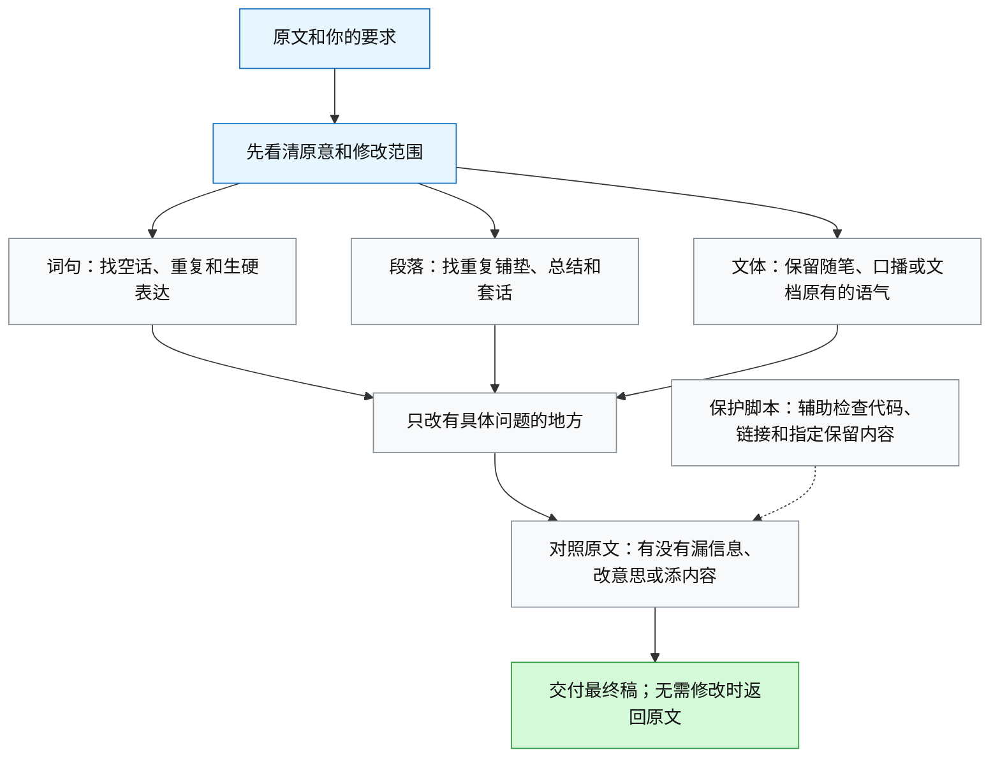

# ai-to-human：中文去 AI 味儿 Skill

把中文文案里的空话、重复和生硬表达改掉，让文字读起来更自然。保留原意、事实和作者的语气，只改有问题的地方；原文已经写得好，就不改。

## 安装

### npx 安装

```bash
npx skills add jason-effi-lab/ai-to-human
```

### 让 Agent 安装

把这句话发给你的 Agent：

```text
帮我安装这个 Skill：https://github.com/jason-effi-lab/ai-to-human
```

### 手动复制

下载仓库，把 `SKILL.md`、`LICENSE`、`references/` 和 `scripts/` 放到客户端的 Skills 目录下，文件夹命名为 `ai-to-human`。安装后重新加载 Skill 或开启新会话。

## 使用

```text
用 ai-to-human 去掉下面这段文案的 AI 味儿，保留原意和我的语气：

[原文]
```

也可以指定文件，或要求“只提建议，不修改文件”。

## SKILL 是如何去 AI 味儿的



具体规则见 [SKILL.md](SKILL.md)。保护脚本需要 Python 3。

## 来源与许可

采用 [MIT 许可](LICENSE)。参考资料见[来源说明](references/sources.md)。
